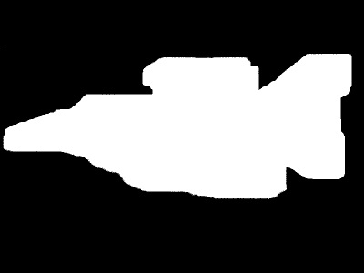
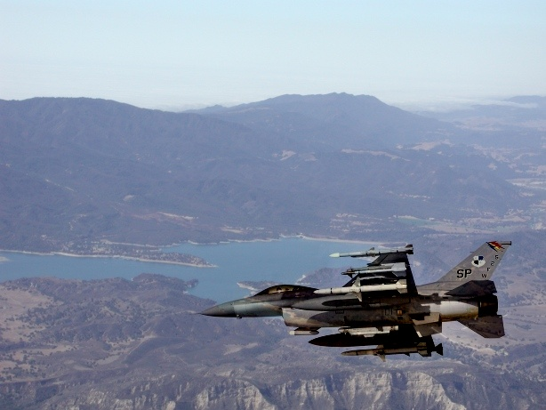
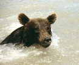
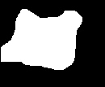
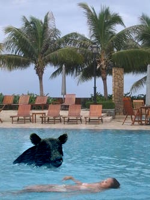
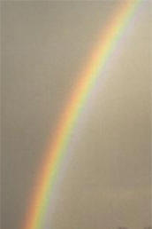
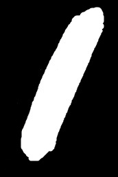
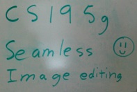
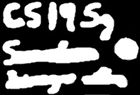
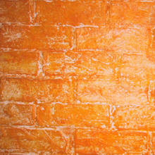

# Poisson Image Editing 泊松图像融合

主要实现了 Pérez 等人在 2003 年发表的论文 [Poisson Image Editing](
https://www.cs.jhu.edu/~misha/Fall07/Papers/Perez03.pdf) 中的基本算法。

## 原理
我们可以在目的图片上确定一个感兴趣区域，把这个区域用一张源图片中的区域替代。由于两张图片的差异，直接把源图片中的区域粘贴到目的图片，得到的结果可能会很不协调。为此，我们增加一些修改目的图片的约束：第一，目的图片中感兴趣区域的边界像素和外部周边的像素没有显著差异，第二，目的图片中感兴趣区域内部的像素的梯度变化趋势符合源图片的对应像素的梯度变化趋势。见上述论文公式 (7)。这样就达到了无缝内容复制，即 seamless cloning 的目的。

本质上说，该算法是用一组特定的梯度变化图作为引导，在确保边界不变的情况下，修改一张图片某个封闭区域的像素值。

## 实现
实现方法参见 [SparseSolve.cpp](PoissonImageEditing/SparseSolve.cpp)。代码的编译和链接仅依赖 OpenCV，可选 2.4.5 及以上的版本。代码测试图片的来源参见注释。

泊松图像融合算法需要求解一个线性方程组 $\mathbf A \mathbf x = \mathbf b$。根据论文的建议，我用 [Gauss-Seidel 算法](https://en.wikipedia.org/wiki/Gauss%E2%80%93Seidel_method) 求解了这个方程。我最早期的实现位于 [Solve.cpp](PoissonImageEditing/Solve.cpp) 中。当时我直接采用 OpenCV 的 `cv::Mat` 去表示 $\mathbf A$，由于这个矩阵的行列数等于感兴趣区域像素的数量，当感兴趣区域比较大的时候，存储数据量很大，而且运算速度很慢。根据论文中的公式 (7) 很容易发现其实这个矩阵 $\mathbf A$ 是一个稀疏矩阵，于是我自己写了一个 SparseMat 结构，并用这个稀疏矩阵求解方程，代码位于 [SparseSolve.cpp](PoissonImageEditing/SparseSolve.cpp) 中。

## 结果示例
源图片、源图片蒙版和目的图片来自 http://cs.brown.edu/courses/csci1950-g/results/proj2/pdoran/
### 第一组

源图片

源图片蒙版

目的图片

结果图片

### 第二组

源图片

源图片蒙版

目的图片

结果图片

### 第三组

源图片

源图片蒙版

目的图片

结果图片

### 第四组

源图片

源图片蒙版

目的图片

结果图片

